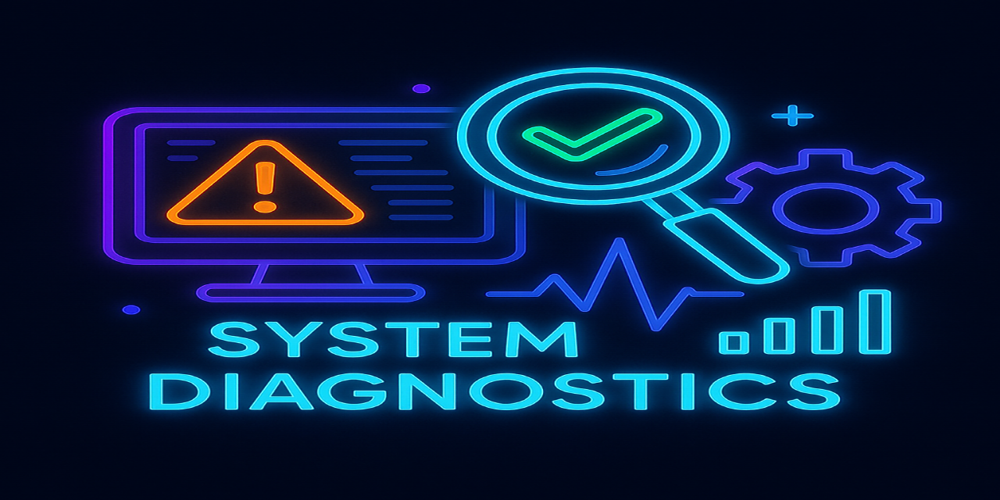

# 🧠 System Diagnose Tool – Kali/Linux CLI Analyzer

||
|---|

Ein interaktives, farbcodiertes CLI-Diagnosetool für Kali Linux und andere Debian-Systeme. Entwickelt zur schnellen Erkennung und automatisierten Analyse von System-, Netzwerk- und Sicherheitsproblemen – mit optionalen Root-Rechten, erweiterten Netzwerktools und modularer Erweiterbarkeit.

---

## 📚 Inhaltsverzeichnis

- [🧠 System Diagnose Tool – Kali/Linux CLI Analyzer](#-system-diagnose-tool--kalilinux-cli-analyzer)
- [📚 Inhaltsverzeichnis](#-inhaltsverzeichnis)
- [📦 Voraussetzungen](#-voraussetzungen)
- [📥 Installation](#-installation)
  - [1. Repository klonen](#1-repository-klonen)
  - [2. Abhängigkeiten installieren](#2-abhängigkeiten-installieren)
  - [3. Optional: Tools für Netzwerkdiagnose installieren](#3-optional-tools-für-netzwerkdiagnose-installieren)
- [🛡️ Root-Rechte korrekt einrichten](#️-root-rechte-korrekt-einrichten)
- [▶️ Anwendung starten](#️-anwendung-starten)
- [🧩 Menüübersicht](#-menüübersicht)
- [🛠 Funktionsübersicht](#-funktionsübersicht)
- [📁 Projektstruktur](#-projektstruktur)
- [📝 Lizenz](#-lizenz)

---

## 📦 Voraussetzungen

| Komponente     | Benötigt     | Beschreibung                        |
|----------------|--------------|-------------------------------------|
| OS             | ✅ Linux      | Debian-basiert (Kali empfohlen)     |
| Python         | ✅ 3.8+       | Für psutil, colorama                |
| Netzwerktools  | 🔸 optional   | `net-tools`, `traceroute`, `dnsutils`, `ufw` |

---

## 📥 Installation

### 1. Repository klonen

```bash
git clone https://github.com/dein-benutzername/system-diagnose-tool.git
cd system-diagnose-tool
```

<br>

### 2. Abhängigkeiten installieren

```yarn
pip install psutil colorama
```

<br>

### 3. Optional: Tools für Netzwerkdiagnose installieren

```yarn
sudo apt update
sudo apt install net-tools ufw traceroute dnsutils
```

<br>

---

<br>

## 🛡️ Root-Rechte korrekt einrichten
- Einmalig mit Root-Rechten ausführen:

```yarn
sudo python3 diagnose_tool.py
```

> Dauerhafte Sudo-Konfiguration (optional, fortgeschritten):

```yarn
sudo visudo
```

> Alternativ: Symbolischer Link im Systempfad

```yarn
sudo ln -s /home/thorsten/system-diagnose-tool/diagnose_tool.py /usr/local/bin/sysdiag
```

> Dann aufrufbar mit:

```yarn
sudo sysdiag
```

<br>

---

<br>

## ▶️ Anwendung starten

```yarn
sudo python3 diagnose_tool.py
```

<br>

---

<br>

## 🧩 Menüübersicht

```yarn
1.  Alle Checks ausführen
2.  Festplattenprüfung
3.  RAM Prüfung
4.  CPU Prüfung
5.  Netzwerkprüfung
6.  Systemupdateprüfung
7.  Temperaturprüfung
8.  Prozessprüfung
9.  Dienstprüfung
10. Offene Ports anzeigen
11. Firewall Status prüfen
12. Traceroute zu Google
13. DNS Lookup für Google
0.  Beenden
```

<br>

---

<br>

## 🛠 Funktionsübersicht

```yarn
Systemanalyse
 Festplattenbelegung
 RAM-Auslastung
 CPU-Auslastung
 Temperaturüberwachung
 Uptime
 Kernel-Version
 Batterieprüfung (optional)
```

<br>

---

<br>

## Netzwerk

```yarn
 Verbindungstest (Ping)
 Traceroute
 DNS Lookup
 Offene Ports (netstat)
 Firewall-Status (ufw),
```

<br>

---

<br>

## Dienste & Sicherheit

```yarn
 Dienststatus: ssh, apache2, mysql
 Verdächtige Prozesse (ssh, nc, nmap)
 Eingeloggte Benutzer
```

<br>

---

<br>

## 📁 Projektstruktur

```yarn
system-diagnose-tool/
├── diagnose_tool.py
├── README.md
├── assets/
│   └── system_diagnostics_neon.png
```

<br>

---

<br>

## 📝 Lizenz

```YARN
MIT License © 2025 Thorsten Bylicki
```
